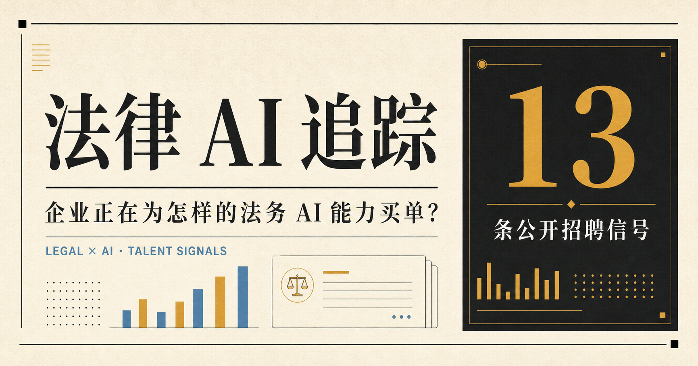

# 法律 AI 招聘情报看板

一个面向法律 AI 从业者、转型者和招聘研究者的公开招聘信号看板。项目把分散在企业招聘官网、招聘平台和职业社交网站中的岗位，整理为可搜索、可筛选、可回溯来源的结构化样本，并进一步提炼岗位背后的能力需求。

## [→ 在线打开看板](https://hermes-nomos.github.io/legal-ai-job-tracker/)

GitHub Pages 公开版无需注册或登录，使用电脑或手机浏览器即可直接访问。完整动态版保留在 [备用地址](https://legal-ai-talent-radar.zhangzhuoqun70.chatgpt.site)。



## 为什么做这个项目

“法律 AI 产品经理”“法务 AI 应用专家”“Legal Engineer”等岗位名称并不统一，职责还横跨法律、产品、技术、交付和客户成功。普通招聘软件很难回答这些问题：

- 市场上真正出现了哪些法律 AI 岗位？
- 企业愿意为什么能力付费？
- 法律背景的人可以从哪些相邻岗位切入？
- 产品、技术、运营和解决方案岗位的边界如何变化？

这个项目希望建立一个可以共同维护的公开样本库，让零散招聘信息逐渐形成可验证的市场观察。

## 当前能力

- 展示经人工整理的法律 AI 招聘与市场信号样本；
- 按关键词、地区、岗位类型和状态筛选；
- 查看岗位摘要、能力标签、研究判断与原始来源；
- 在浏览器会话内收藏条目；
- 手动触发一次公开招聘页检索，并将新发现的结果临时合并到当前页面；
- 提供日报视图、数据库视图、趋势视图和数据口径说明。

当前版本仍是研究型 MVP：内置数据是阶段性快照，手动刷新结果不会写入数据库，也没有正式的定时更新、失效核验和用户系统。路线图见[独立公开部署与复刻指南](./独立公开部署与复刻指南.md)。

## 快速开始

环境要求：Node.js `>=22.13.0`。

```bash
git clone https://github.com/hermes-nomos/legal-ai-job-tracker.git
cd legal-ai-job-tracker
npm install
npm run dev
```

浏览器访问终端显示的本地地址。正式构建和测试：

```bash
npm run build
npm test
```

如需生成正确的分享卡片绝对地址，复制 `.env.example` 为 `.env.local`，并设置部署后的公开站点地址。

## 项目结构

```text
app/page.tsx                看板页面、内置岗位样本与交互
app/api/refresh/route.ts    演示性实时检索接口
app/globals.css             页面样式与响应式布局
app/layout.tsx              页面元信息与社交分享配置
public/og.png               社交分享预览图
tests/                      构建产物与数据边界测试
.openai/hosting.json        Sites 项目配置
```

项目基于 React、Next.js API 和 vinext 构建，并保留 Cloudflare Worker 兼容的部署结构。

## 数据口径

每条岗位记录至少应包含：公司、岗位、地点、薪资或“未公开”、经验、学历、发现或核验时间、来源名称、原始链接、能力标签、摘要与研究判断。

维护时遵循以下原则：

1. 优先使用企业招聘官网，其次使用公开可访问的主流招聘平台与职业社交网站；
2. 只保留必要的事实字段和转述摘要，不复制完整招聘页面；
3. 区分网页发布日期、项目发现日期和最后核验日期；
4. 岗位状态必须以原始页面为准，无法确认时标记为“观察”而不是推断为“热招”；
5. 不绕过登录、验证码、robots.txt、访问频率限制或其他技术措施；
6. 不采集求职者简历、手机号、邮箱等个人信息。

看板中的“研究判断”属于项目维护者基于公开信息作出的分析，不代表招聘企业的官方表述。

## 参与贡献

欢迎提交以下贡献：

- 新增公开可验证的法律 AI 岗位；
- 纠正薪资、地点、状态、来源或核验日期；
- 改进岗位分类、能力标签和趋势分析方法；
- 增加新的公开数据源适配器；
- 改善搜索、去重、持久化、可访问性或部署体验。

请先阅读 [CONTRIBUTING.md](./CONTRIBUTING.md)。单纯新增或纠正数据，可以直接使用仓库的 Issue 模板，无需先修改代码。

## 合规与免责声明

本项目用于行业研究和职业信息整理，不提供招聘中介服务，也不保证岗位仍在招聘、薪资准确或用户满足任职要求。访问和使用第三方招聘信息时，应同时遵守对应网站的服务条款、robots.txt 和适用法律。

源代码与本项目原创文档采用 [MIT License](./LICENSE)。第三方公司名称、商标、职位事实及其原始页面内容仍归相应权利人所有，不因本项目采用 MIT License 而改变。

## 维护者

[hermes-nomos](https://github.com/hermes-nomos) · Legal AI / Product / Law
