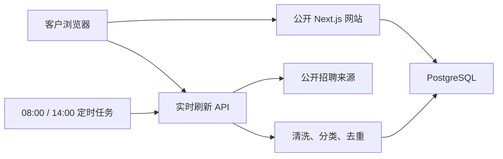

# 法律 AI 招聘情报看板：独立公开部署与复刻路线图

> 本文描述的是后续正式服务的目标架构，并非当前版本已经实现的功能。当前版本是研究型 MVP：内置阶段性数据快照，支持演示性实时检索，但尚未实现数据库持久化、定时任务和正式的状态核验。
>
> 目标：把当前看板迁移到自己控制的站点，任何客户无需登录即可访问；支持网页实时刷新、每天 08:00/14:00 自动更新、数据持久化、原始来源追溯。
>
> 当前项目目录：`招聘信息追踪看板/`

## 一、推荐结论

### 面向境外及一般互联网客户

推荐：

```text
GitHub
  ↓ 自动部署
Vercel（Next.js 网站与 API）
  ↓
PostgreSQL（Supabase / Neon / 自建）
  ↓
Vercel Cron（每天 00:00、06:00 UTC）
```

优点：

- 网站天然公开，不要求客户登录；
- 当前界面是 React/Next.js，迁移改动最少；
- 可以绑定自己的域名；
- 前端、API、定时任务放在同一项目；
- GitHub 推送后自动发布。

### 主要客户在中国大陆

推荐：

```text
腾讯云轻量应用服务器或云服务器
  + Docker
  + PostgreSQL
  + Nginx
  + Linux cron
  + 已备案自有域名
```

原因：如果使用中国大陆服务器公开提供网站，通常需要先完成 ICP 备案。腾讯云官方说明见：

- https://cloud.tencent.com/document/product/243/39038
- https://cloud.tencent.com/document/product/243/18910

如果暂时不备案，可以先使用香港、新加坡等地区的服务器，但中国大陆访问速度和稳定性不能等同于大陆节点。

## 二、当前项目的真实技术结构

```text
app/page.tsx
├─ 看板界面
├─ 搜索、地区、类型、状态筛选
├─ 日报、数据库、趋势视图
└─ 点击刷新后合并实时结果

app/api/refresh/route.ts
├─ 查询公开招聘搜索页面
├─ 解析职位、公司、地点、薪资
├─ 按原始职位链接去重
└─ 返回最多 20 条实时结果

app/globals.css
└─ 全部视觉样式与响应式布局

public/og.png
└─ 分享链接时使用的社交预览图
```

当前网页刷新得到的数据只保存在当前浏览器会话中。要成为正式客户服务，需要把数据写入数据库，而不是继续写死在 `page.tsx`。

## 三、正式版本建议架构



### 数据流

1. 定时任务或网页刷新按钮调用 `/api/refresh`。
2. 后台查询公开可访问的招聘页面。
3. 将结果标准化为统一字段。
4. 用 `公司 + 职位 + 地点` 以及 `source_url` 双重去重。
5. 新职位写入数据库；旧职位更新最后核验时间。
6. 多次无法访问或页面明确失效的职位改为 `expired`。
7. 看板通过 `/api/jobs` 读取数据库。

## 四、数据库表

最小版本可使用下面的 PostgreSQL 表：

```sql
create table jobs (
  id bigserial primary key,
  company text not null,
  title text not null,
  city text,
  salary text,
  experience text,
  education text,
  category text,
  status text not null default 'active',
  source text not null,
  source_url text not null unique,
  published_at timestamptz,
  discovered_at timestamptz not null default now(),
  last_verified_at timestamptz not null default now(),
  summary text,
  signal text,
  scope jsonb not null default '[]'::jsonb,
  raw_hash text,
  created_at timestamptz not null default now(),
  updated_at timestamptz not null default now()
);

create index jobs_status_idx on jobs(status);
create index jobs_discovered_at_idx on jobs(discovered_at desc);
create index jobs_company_title_idx on jobs(company, title);

create table refresh_runs (
  id bigserial primary key,
  started_at timestamptz not null default now(),
  finished_at timestamptz,
  trigger_type text not null,
  scanned_sources integer not null default 0,
  discovered_count integer not null default 0,
  inserted_count integer not null default 0,
  updated_count integer not null default 0,
  expired_count integer not null default 0,
  status text not null default 'running',
  error_message text
);
```

## 五、把当前代码改成标准 Next.js

当前项目使用了针对原托管平台的构建结构。独立部署时建议创建一个干净的标准 Next.js 项目，再复制页面和 API。

### 1. 创建项目

```bash
npx create-next-app@latest legal-ai-radar \
  --typescript \
  --eslint \
  --app \
  --use-pnpm

cd legal-ai-radar
```

### 2. 复制文件

把当前项目中的以下文件复制到新项目：

```text
app/page.tsx
app/globals.css
app/layout.tsx
app/api/refresh/route.ts
public/og.png
public/favicon.svg
```

### 3. 标准构建命令

`package.json` 应使用：

```json
{
  "scripts": {
    "dev": "next dev",
    "build": "next build",
    "start": "next start",
    "lint": "eslint ."
  }
}
```

不要复制以下原平台专用内容：

```text
.openai/
build/sites-vite-plugin.ts
vite.config.ts
worker/
vinext 依赖
```

## 六、把岗位数据从页面移到数据库

### 1. 安装数据库客户端

以 PostgreSQL 为例：

```bash
pnpm add postgres
```

### 2. 数据库连接

创建 `lib/db.ts`：

```ts
import postgres from "postgres";

export const sql = postgres(process.env.DATABASE_URL!, {
  ssl: "require",
  max: 5,
});
```

### 3. 岗位查询接口

创建 `app/api/jobs/route.ts`：

```ts
import { sql } from "@/lib/db";

export const dynamic = "force-dynamic";

export async function GET() {
  const jobs = await sql`
    select *
    from jobs
    where status <> 'deleted'
    order by discovered_at desc, id desc
    limit 500
  `;

  return Response.json(
    { items: jobs },
    {
      headers: {
        "Cache-Control": "no-store",
        "Content-Type": "application/json; charset=utf-8"
      }
    }
  );
}
```

然后把 `page.tsx` 中的固定 `jobs` 数组替换为：

```ts
useEffect(() => {
  fetch("/api/jobs", { cache: "no-store" })
    .then((response) => response.json())
    .then((data) => setRecords(data.items));
}, []);
```

## 七、实时刷新接口应该怎样工作

正式版本不要让每个访客无限触发外部抓取，否则容易被恶意重复调用。

建议规则：

- 每个 IP 每 10 分钟最多触发一次；
- 全站距离上次刷新不足 5 分钟时直接返回数据库缓存；
- 单个来源超时设置为 10～15 秒；
- 一个来源失败不影响其他来源；
- 每轮限制请求数量和返回岗位数量；
- 只访问公开页面，不绕过验证码、登录和反爬限制；
- 保存原始链接和最后核验时间。

接口伪代码：

```ts
export async function POST(request: Request) {
  // 1. 检查最近一次成功刷新时间
  // 2. 未超过冷却时间：直接返回数据库最新数据
  // 3. 超过冷却时间：并行查询允许访问的公开来源
  // 4. 标准化字段
  // 5. 按 source_url 和 公司+职位+地点 去重
  // 6. upsert 到 jobs
  // 7. 写入 refresh_runs
  // 8. 返回新增、更新、失效数量
}
```

网页按钮：

```ts
const refreshNow = async () => {
  setRefreshing(true);

  try {
    const response = await fetch("/api/refresh", {
      method: "POST",
      cache: "no-store"
    });
    const data = await response.json();
    setRecords(data.items);
    setRefreshNote(`新增 ${data.insertedCount} 条`);
  } finally {
    setRefreshing(false);
  }
};
```

## 八、每天 08:00 和 14:00 自动更新

### Vercel 方案

Vercel 的 Cron 使用 UTC。北京时间 08:00、14:00 对应 UTC 00:00、06:00。

创建 `vercel.json`：

```json
{
  "$schema": "https://openapi.vercel.sh/vercel.json",
  "crons": [
    {
      "path": "/api/cron/refresh",
      "schedule": "0 0 * * *"
    },
    {
      "path": "/api/cron/refresh",
      "schedule": "0 6 * * *"
    }
  ]
}
```

创建 `app/api/cron/refresh/route.ts`：

```ts
export const dynamic = "force-dynamic";

export async function GET(request: Request) {
  const authorization = request.headers.get("authorization");

  if (authorization !== `Bearer ${process.env.CRON_SECRET}`) {
    return new Response("Unauthorized", { status: 401 });
  }

  // 直接调用公共的 refreshService()，不要通过 HTTP 再调用自己。
  const result = await refreshService({ trigger: "cron" });
  return Response.json(result);
}
```

Vercel 官方 Cron 说明：

- https://examples.vercel.com/docs/cron-jobs/quickstart
- Cron 仅在生产部署运行；
- 时间表达式按 UTC；
- 应设置 `CRON_SECRET`；
- 套餐的任务频率和执行时长限制需要在开通前确认。

### Cloudflare Workers 方案

Cloudflare Cron Trigger 同样使用 UTC：

```json
{
  "triggers": {
    "crons": [
      "0 0 * * *",
      "0 6 * * *"
    ]
  }
}
```

Worker：

```ts
export default {
  async fetch(request, env, ctx) {
    return app.fetch(request, env, ctx);
  },

  async scheduled(controller, env, ctx) {
    ctx.waitUntil(refreshJobs(env));
  }
};
```

官方资料：

- https://developers.cloudflare.com/workers/configuration/cron-triggers/
- https://developers.cloudflare.com/workers/framework-guides/web-apps/nextjs/

Cloudflare 当前建议动态 Next.js 项目部署到 Workers，而不是把需要 API 的项目当作纯静态 Pages 项目。

## 九、部署到 Vercel

### 1. 推送 GitHub

```bash
git init
git add .
git commit -m "Initial legal AI radar"
git branch -M main
git remote add origin https://github.com/你的账号/legal-ai-radar.git
git push -u origin main
```

### 2. 在 Vercel 导入

1. 登录 Vercel。
2. 选择 `Add New Project`。
3. 导入 GitHub 仓库。
4. Framework 选择 Next.js。
5. 添加环境变量：

```text
DATABASE_URL=PostgreSQL连接地址
CRON_SECRET=长度至少32位的随机字符串
```

6. 点击部署。

部署成功后会得到：

```text
https://legal-ai-radar-xxx.vercel.app
```

此地址默认公开，不需要访客登录。

### 3. 绑定自有域名

例如：

```text
radar.yourcompany.com
```

在 Vercel 项目的 Domains 中添加域名，并按提示配置 DNS。

## 十、中国大陆自建部署

Next.js 官方建议自建时在应用前放置 Nginx 等反向代理：

- https://nextjs.org/docs/app/guides/self-hosting

### Dockerfile

```dockerfile
FROM node:22-alpine AS deps
WORKDIR /app
COPY package.json pnpm-lock.yaml ./
RUN corepack enable && pnpm install --frozen-lockfile

FROM node:22-alpine AS builder
WORKDIR /app
COPY --from=deps /app/node_modules ./node_modules
COPY . .
RUN corepack enable && pnpm build

FROM node:22-alpine AS runner
WORKDIR /app
ENV NODE_ENV=production
COPY --from=builder /app ./
EXPOSE 3000
CMD ["sh", "-c", "corepack enable && pnpm start"]
```

### docker-compose.yml

```yaml
services:
  web:
    build: .
    restart: unless-stopped
    environment:
      DATABASE_URL: ${DATABASE_URL}
      CRON_SECRET: ${CRON_SECRET}
    ports:
      - "127.0.0.1:3000:3000"

  postgres:
    image: postgres:17-alpine
    restart: unless-stopped
    environment:
      POSTGRES_DB: legal_ai
      POSTGRES_USER: legal_ai
      POSTGRES_PASSWORD: ${POSTGRES_PASSWORD}
    volumes:
      - postgres_data:/var/lib/postgresql/data

volumes:
  postgres_data:
```

### Nginx

```nginx
server {
    listen 80;
    server_name radar.example.com;

    location / {
        proxy_pass http://127.0.0.1:3000;
        proxy_http_version 1.1;
        proxy_set_header Host $host;
        proxy_set_header X-Real-IP $remote_addr;
        proxy_set_header X-Forwarded-For $proxy_add_x_forwarded_for;
        proxy_set_header X-Forwarded-Proto $scheme;
    }
}
```

再使用 Certbot 或云厂商证书服务配置 HTTPS。

### Linux 定时任务

```cron
0 8 * * * curl -fsS -H "Authorization: Bearer 你的CRON_SECRET" https://radar.example.com/api/cron/refresh
0 14 * * * curl -fsS -H "Authorization: Bearer 你的CRON_SECRET" https://radar.example.com/api/cron/refresh
```

Linux 服务器时区需要设置为 `Asia/Shanghai`。若服务器使用 UTC，则改为 `0 0 * * *` 和 `0 6 * * *`。

## 十一、正式客户服务必须补充的能力

### 必须有

- 自有域名与 HTTPS；
- 数据库存储；
- 刷新接口限流；
- 定时任务鉴权；
- 来源链接与最后核验时间；
- 失效岗位状态；
- 错误日志；
- 数据备份；
- 隐私政策与服务说明；
- 明确说明“岗位状态以原始招聘页面为准”。

### 建议有

- 后台管理页；
- 来源黑白名单；
- 搜索关键词配置；
- 邮件或企业微信更新通知；
- 失败来源自动降级；
- 近 7/30/90 天趋势统计；
- CSV/Excel 导出；
- 客户收藏与订阅。

## 十二、合规边界

可以做：

- 搜索公开可访问页面；
- 保存职位名称、公司、地点、摘要和原始链接；
- 低频、限速地检查页面状态；
- 遵守网站的 robots.txt 和服务条款；
- 收到下架要求后及时处理。

不要做：

- 绕过登录、验证码或访问限制；
- 大规模高频抓取；
- 采集求职者简历、电话、邮箱等个人信息；
- 把招聘平台完整页面或大量原文复制到自己的站点；
- 把 AI 摘要表述成招聘企业的官方结论。

## 十三、最短落地清单

```text
[ ] 新建标准 Next.js 项目
[ ] 复制页面、样式、刷新 API 和图片
[ ] 新建 PostgreSQL 数据库
[ ] 创建 jobs 与 refresh_runs 表
[ ] 将 page.tsx 固定数据改为 /api/jobs
[ ] 将 /api/refresh 改为数据库 upsert
[ ] 加入 5～10 分钟全站刷新冷却
[ ] 加入 CRON_SECRET
[ ] 配置 00:00、06:00 UTC 定时任务
[ ] 推送 GitHub
[ ] 部署到 Vercel 或 Cloudflare Workers
[ ] 绑定自有域名
[ ] 验证未登录访问
[ ] 验证刷新、定时任务和失效标记
```

## 十四、选择建议

| 场景 | 建议 |
|---|---|
| 想最快公开给客户试用 | Vercel + Supabase/Neon |
| 已有 Cloudflare 账号与域名 | Cloudflare Workers + D1/PostgreSQL |
| 客户主要在中国大陆 | 腾讯云/阿里云大陆服务器 + 备案 |
| 需要完全掌控数据与访问日志 | 自建 Docker + PostgreSQL + Nginx |
| 只是短期演示 | 保留当前公开站点 |

如果目标是“本周内给客户使用”，建议先走 **Vercel + PostgreSQL + 自有域名**；如果客户主要位于中国大陆并且这是长期正式服务，则直接规划 **大陆云服务器 + ICP 备案**，避免后期二次迁移。
